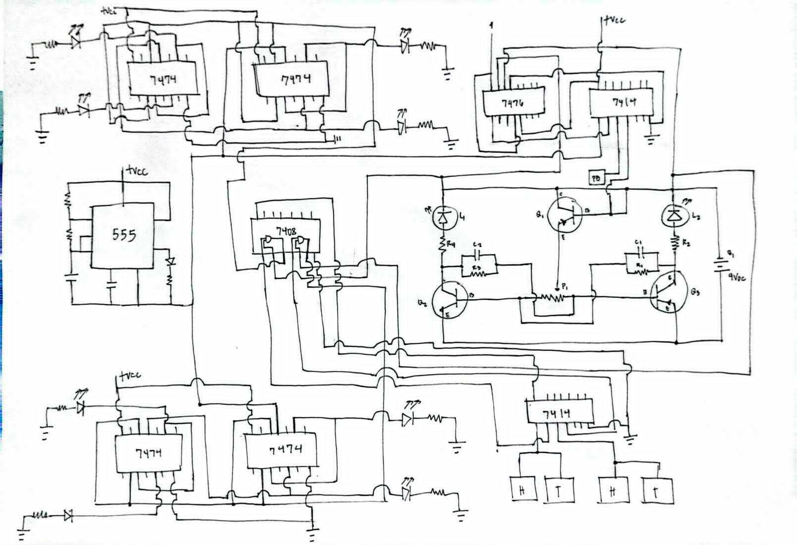

# Digital Logic Toss Coin Emulator

A first-year engineering experiment in discrete logic design, built from scratch using first principles.

## 📖 Introduction
This project was initiated during my first year of college out of pure curiosity regarding how Integrated Circuits (ICs) function at a fundamental level. While studying digital logic in my major subjects, I wanted to apply that knowledge to build something tangible without relying on microcontrollers, pre-written libraries, or AI.

This project, a **Digital Toss Coin Emulator**, was designed entirely from scratch. My goal was to create a hardware-based random event generator using only discrete TTL (Transistor-Transistor Logic) ICs. The project served as an experimental deep-dive into how logic gates, timers, and flip-flops interact in a real-world physical environment.

## 📸 Prototype

   
  <em>Figure 1: The assembled Toss Coin circuit on a perfboard.</em>

## 📋 Schematic Diagram
The following schematic outlines the circuit logic designed for this toss coin emulator:

  

## 🛠️ Bill of Materials
The circuit utilizes the following components to achieve the desired logic operations:

| Component | Quantity | Role |
| :--- | :--- | :--- |
| **555 Timer IC** | 1 | Master Clock (Astable Oscillator) |
| **7474 IC (Dual D Flip-Flop)** | 4 | State Memory / Randomizer |
| **7476 IC (Dual JK Flip-Flop)** | 1 | Toggle Logic |
| **7414 IC (Hex Inverter)** | 2 | Signal Conditioning / Schmitt Trigger |
| **7408 IC (Quad AND Gate)** | 1 | Output Decision Logic |
| **2N3904 Transistors** | 3 | LED Drivers (Output Switching) |
| **Push Button** | 2 | User Input (Gate Control) |
| **Potentiometer (50kΩ)** | 1 | Frequency Tuning |
| **LEDs (Red/Green)** | 2 | Visual Indicators |
| **Passives (Resistors/Caps)** | Various | Timing & Signal Integrity |

---

## ⚙️ Operational Theory
The circuit operates as a state machine where randomness is derived from the inability of the user to time a button release against a high-frequency clock signal.

### 1. The Heartbeat (Clock Generation)
[Image of 555 timer astable multivibrator circuit]
The 555 Timer is configured in **Astable Mode**. The potentiometer adjusts the charge/discharge rate, creating a square wave that pulses hundreds of times per second. This pulse acts as the "randomness generator"—when the clock is running, the state of the circuit is toggling faster than the eye can perceive.

### 2. Logic and Memory (The "Coin")
[Image of flip-flop logic symbol]
The circuit utilizes D-type (7474) and JK (7476) Flip-Flops as memory cells.
* **Toggle Configuration:** The flip-flops are wired to invert their output on every rising edge of the clock signal.
* **State Latency:** While the button is pressed, the clock signal propagates to these flip-flops, causing them to rapidly switch between logic high and low.
* **Randomization:** Releasing the button interrupts the clock pulse, forcing the flip-flops to "freeze" at their current state (Heads or Tails).

### 3. Output Driving
[Image of basic transistor LED driver circuit]
The outputs of the logic gates pass through 7408 AND gates to ensure only one LED state is active. Because the logic ICs cannot supply sufficient current to drive LEDs, the signal is routed to the base of **2N3904 Transistors**, which act as current switches to illuminate the LEDs.

---

## ⚠️ Problems Encountered: Stability Analysis
While the theoretical logic holds, the physical implementation exhibited instability. This was an invaluable lesson in hardware engineering:

1.  **Signal Integrity & Noise:** Breadboard wiring created significant "parasitic capacitance" and inductance. The long, unshielded wires acted as antennas, picking up electromagnetic interference (EMI) that caused the flip-flops to toggle randomly.
2.  **Switch Bounce:** The mechanical push button generated contact bounce, which the fast 74-series logic interpreted as multiple presses, causing the "randomness" to jitter.
3.  **Power Distribution:** TTL logic requires stable voltage. Without local decoupling capacitors (0.1µF) at the VCC pins of each IC, the "gulps" of current consumed during state transitions caused ripples in the power supply, leading to erratic logic errors.

## 🚀 Future Works
To transition this prototype from an unstable breadboard experiment to a functional device, the following improvements are recommended:

* **PCB Migration:** Designing a custom Printed Circuit Board (PCB) would allow for short, direct copper traces, eliminating the crosstalk and interference caused by breadboard jumpers.
* **Ground Plane Implementation:** Using a dedicated ground plane layer on the PCB would provide a robust reference voltage and significantly reduce ground bounce.
* **Advanced Filtering:** Integrating dedicated RC debounce circuits for the input button would ensure a cleaner trigger signal for the logic stages.
* **Component Optimization:** Replacing older TTL logic with more modern CMOS (HC or HCT series) would reduce power consumption and improve noise immunity.

## 🏁 Conclusion
Building this Toss Coin circuit from first principles was a challenging but rewarding experience. It taught me that **theoretical design is only the starting line in engineering.** The instability observed in this project was not a failure; it was a demonstration of the physics behind digital electronics. This project proved that to be an effective hardware designer, one must respect the signal integrity and power requirements as much as the logic itself.
